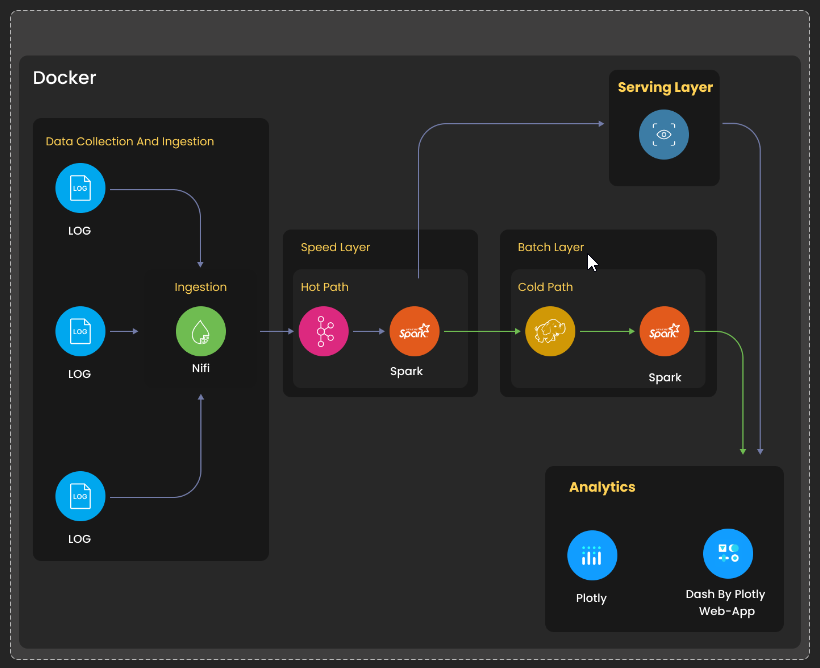
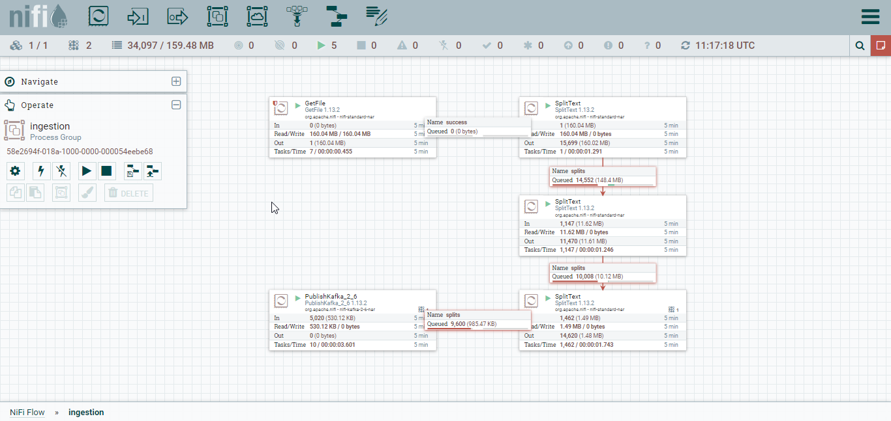
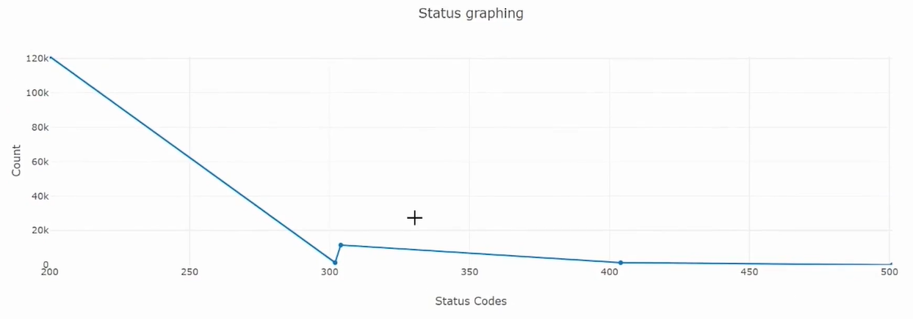

# NASA Real-Time and Batch Log Analytics
This project enables the processing and analysis of the large volume of log data generated by NASA's internal systems and applications.
> Data Source :
> ftp://ita.ee.lbl.gov/traces/NASA_access_log_Aug95.gz


## For what reason?

Analyzing web server logs serves a vital role in gaining valuable insights across various aspects such as security, customer service, and SEO. The data extracted from these logs can be instrumental in:

- Resolving network-related issues
- Facilitating development and quality assurance processes
- Detecting and comprehending security vulnerabilities
- Enhancing customer service

## Architecture

### Data Flow Architecture




### Tech Stack

* Google Compute Engine
* Docker
* Jupyter Lab
* Spark Structured Streaming
* NiFi
* Kafka
* Python
* Cassandra
* Plotly
* Dash

## Environment Configuration


**Kafka configuration**

```bash
docker exec -i -t kafka bash

# creation of topic named nasa_logs
kafka-topics.sh --create --topic nasa_logs --partitions 1 --replication-factor 1 --if-not-exists --zookeeper zookeeper:2181

# list topics
kafka-topics.sh --list --bootstrap-server localhost:29092

# Consume topic
kafka-console-consumer.sh --bootstrap-server localhost:29092 --topic nasa_logs --from-beginning --max-messages 30

# delete topic later
kafka-topics.sh --delete --topic nasa_logs --zookeeper zookeeper:2181
```

**Cassandra configuration**

```bash
docker exec -i -t cassandra bash

# login
cqlsh -u cassandra -p cassandra

# creation of keyspace
CREATE KEYSPACE IF NOT EXISTS loganalysis WITH replication = {'class':'SimpleStrategy', 'replication_factor':1};

# creation of table
CREATE TABLE IF NOT EXISTS loganalysis.nasalog (host text , time text , method text, path text , status text, content_size text, PRIMARY KEY (host));

# delete table later
truncate table loganalysis.nasalog ;
```

**HDFS configuration**

```bash
docker exec -i -t namenode bash

hdfs dfs -mkdir -p /output/nasa_logs/
```

## Screenshots

**Data pipeline on Apache Nifi**




**one the dashbords**



